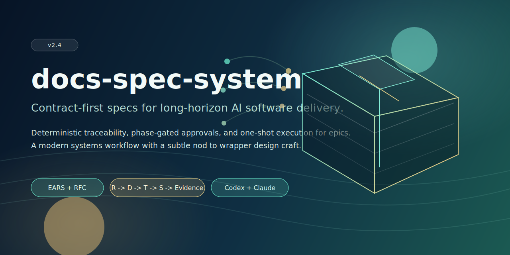
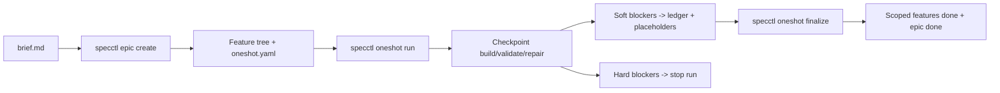

<p align="center">
  
</p>

<h1 align="center">docs-spec-system</h1>

<p align="center">
  A contract-first spec system for long-horizon agentic software delivery.
</p>

<p align="center">
  <a href="https://github.com/dana0550/spec-system/actions/workflows/ci.yml"></a>
  <a href="https://github.com/dana0550/spec-system/actions/workflows/release.yml"></a>
  <a href="https://github.com/dana0550/spec-system/releases"></a>
  
  
  
</p>

<p align="center">
  <a href="#why-spec-system">Why</a> •
  <a href="#quickstart">Quickstart</a> •
  <a href="#epics-and-one-shot">Epics & One-shot</a> •
  <a href="#agent-setup-codex-and-claude">Agent Setup</a> •
  <a href="#cli-reference">CLI</a> •
  <a href="#release-model">Release</a>
</p>

## Install skills
### Codex
```bash
install-skill-from-github.py --repo dana0550/spec-system --path skills/docs-spec-system
```

### Claude Code plugin
```text
/plugin marketplace add dana0550/spec-system
/plugin install docs-spec-system@spec-system-plugins
```

Then use `/docs-spec-system:spec-system` to invoke the skill in Claude Code.

## Why spec-system
Most spec workflows fail on long horizon builds because planning, execution, and verification drift apart. `docs-spec-system` keeps them locked together with deterministic artifacts, strict traceability, and a first-class one-shot runtime for epics.

### What you get
| Capability | What it does |
|---|---|
| `Feature` workflow | One-off feature delivery with phase-gated artifacts (`requirements`, `design`, `tasks`, `verification`). |
| `Epic` workflow | Automatic feature-tree scaffolding from a required `brief.md`. |
| One-shot runtime | Checkpointed build/validate/repair loop with blocker ledger and placeholder policy. |
| Deterministic quality | Enforced IDs, traceability (`R -> D -> T -> S -> evidence`), and contract linting. |
| Memory resilience | Resume-safe run artifacts for context compaction scenarios. |
| Operational fit | CI, release gates, auto-tagging, and optional auto-merge policy. |

## Core model
- `Feature`: isolated delivery unit.
- `Epic`: orchestration unit that generates a root feature, child features, and component leaf features.
- `One-shot`: mandatory execution contract for epics with checkpoint graph + validation + blocker + finalize gates.



## Quickstart
### Install
```bash
git clone https://github.com/dana0550/spec-system.git
cd spec-system
python -m pip install -e .
```

If you prefer module execution without installing the script entrypoint:

```bash
python -m specctl.cli --help
```

### Bootstrap in 60 seconds
```bash
specctl init
specctl feature create --name "User Authentication" --owner team@example.com
specctl render
specctl check
```

## Epics and one-shot
### Brief is a hard requirement
`specctl epic create` requires a `brief.md` with these sections:

- `Vision`
- `Outcomes`
- `User Journeys`
- `Constraints`
- `Non-Goals`

Minimal brief:

```md
## Vision
- Build resilient billing flows.

## Outcomes
- Increase payment completion rate.
- Reduce reconciliation failure rate.

## User Journeys
- Customer completes payment with a saved card.
- Finance user reviews and resolves failed transactions.

## Constraints
- Preserve existing API contracts.

## Non-Goals
- No redesign of external admin UI.
```

### Create an epic (auto decomposition)
```bash
specctl epic create \
  --name "Billing Reliability" \
  --owner team@example.com \
  --brief ./brief.md
```

Deterministic decomposition behavior:

- each `User Journeys` bullet becomes a child feature
- if no journeys exist, each `Outcomes` bullet becomes a child feature
- each child gets component leaves:
  - `Contract/API`
  - `Domain/Data`
  - `Execution/Integration`
  - `Verification/Observability`
- optional `UX/Client` is added when user-facing brief sections (`Vision`, `Outcomes`, `User Journeys`) include UI keywords (`ui`, `frontend`, `screen`, `workflow`, `form`, `dashboard`)

### Execute and finalize one-shot
```bash
specctl oneshot run --epic-id E-001 --runner codex
specctl oneshot check --epic-id E-001
specctl oneshot resume --epic-id E-001 --run-id RUN-<timestamp>
specctl oneshot finalize --epic-id E-001 --run-id RUN-<timestamp>
specctl oneshot report --epic-id E-001
```

Finalize gates enforced:

- zero open blockers
- zero unresolved `ONESHOT-BLOCKER:*` markers
- finalize validation command group passes
- full scoped `R -> D -> T -> S -> evidence` traceability

## Memory resilience
Each run stores continuity artifacts under `docs/epics/E-###-<slug>/memory/`:

| File | Purpose |
|---|---|
| `state.json` | Canonical machine state for the current run. |
| `resume_pack.md` | Compact operator handoff (regen each checkpoint). |
| `decisions.md` | Append-only decision stream (latest 40 retained). |
| `open_threads.md` | Unresolved blockers/threads only. |

Built-in caps:

- `resume_pack.md` max 180 lines
- `resume_pack.md` max 6000 characters

This allows resume continuity without relying on full transcript replay.

## Agent setup (Codex and Claude)
### Codex
1. Install Codex CLI and authenticate.
2. Add repository instructions in `AGENTS.md`.
3. Optionally install the local skill package:

```bash
install-skill-from-github.py --repo dana0550/spec-system --path skills/docs-spec-system
```

Suggested `AGENTS.md` seed:

```md
Use $docs-spec-system and specctl to run the v2 phase-gated workflow
(requirements -> design -> tasks -> verification) with EARS+RFC requirements,
Gherkin scenarios, and full traceability.
```

Official references:

- <https://developers.openai.com/codex/guides/agents-md>
- <https://developers.openai.com/codex/noninteractive>
- <https://developers.openai.com/codex/cli/reference>
- <https://developers.openai.com/blog/run-long-horizon-tasks-with-codex>

### Claude Code
1. Install Claude Code and authenticate.
2. Add repository instructions in `CLAUDE.md`.
3. Optionally configure `.claude/settings.json` hooks for policy checks.

Suggested `CLAUDE.md` seed:

```md
Use specctl as the source of truth for spec operations.
Before concluding work, run: specctl lint, specctl render --check, specctl check.
For epics, enforce oneshot run/check/finalize gates and blocker closure.
```

Official references:

- <https://docs.anthropic.com/en/docs/claude-code/quickstart>
- <https://docs.anthropic.com/en/docs/claude-code/memory>
- <https://docs.anthropic.com/en/docs/claude-code/hooks>
- <https://docs.anthropic.com/en/docs/claude-code/cli-reference>

## CLI reference
```bash
specctl init

specctl feature create --name "..." --owner <owner>
specctl feature check --feature-id F-###

specctl epic create --name "..." --owner <owner> --brief ./brief.md
specctl epic check --epic-id E-###

specctl oneshot run --epic-id E-### [--runner codex|claude]
specctl oneshot resume --epic-id E-### --run-id RUN-...
specctl oneshot check --epic-id E-### [--run-id RUN-...]
specctl oneshot finalize --epic-id E-### --run-id RUN-...
specctl oneshot report --epic-id E-### [--json]

specctl lint
specctl render [--check]
specctl check
specctl approve --feature-id F-### --phase requirements|design|tasks
specctl migrate-v1-to-v2
specctl report [--json]
```

## Generated artifact layout
```text
docs/
  MASTER_SPEC.md
  FEATURES.md
  EPICS.md
  PRODUCT_MAP.md
  TRACEABILITY.md
  STEERING.md
  DECISIONS/
    ADR_TEMPLATE.md
  features/
    F-001-<slug>/
      requirements.md
      design.md
      tasks.md
      verification.md
  epics/
    E-001-<slug>/
      brief.md
      decomposition.yaml
      oneshot.yaml
      memory/
      runs/
```

## Validation and checks
Standard quality gate:

```bash
specctl lint
specctl render --check
specctl check
python -m pytest
```

One-off feature check:

```bash
specctl feature check --feature-id F-001
```

Epic-specific checks:

```bash
specctl epic check --epic-id E-001
specctl oneshot check --epic-id E-001
```

## Migration from v1
```bash
specctl migrate-v1-to-v2
specctl check
```

Migration writes backups under `.specctl-backups/migrate-<timestamp>/` and a report at `docs/MIGRATION_REPORT.md`.

Upgrade safety note:
- Running `specctl migrate-v1-to-v2` on existing v2/v2.1 workspaces is non-destructive for feature artifacts and backfills missing base docs (for example `EPICS.md`).

## Release model
### CI
`ci.yml` runs on PRs and pushes to `main` and validates fixture docs, generated workspace smoke, migration smoke, and tests.

### Release
`release.yml` runs on tags matching `v*.*.*` and enforces:

- tag commit must be on `main`
- tag must match `pyproject.toml` version
- lint/render/check/tests must pass

Manual tag flow from `main`:

```bash
git fetch origin
git switch main
git pull --ff-only
git tag -a v2.1.0 -m "docs-spec-system v2.1.0"
git push origin v2.1.0
```

Automation in this repo:

- `auto-tag-from-main.yml` auto-creates `v<pyproject.version>` on `main` when missing
- `auto-merge.yml` can merge PRs once checks are green and bugbot review threads are resolved

## Repository layout
```text
skills/docs-spec-system/
  SKILL.md
  agents/
  references/
  assets/templates/
specctl/
tests/
assets/readme/
```

## Development
```bash
python -m pip install -e .
python -m pytest
```

## License
MIT (declared in `pyproject.toml`).
